# 《Web开发1》 课程设计之育儿网站

## 设计目的

1.	熟练掌握HTML在组织结构上的优势。

2.	熟练掌握CSS在网页布局中的应用。

3.	学习Web标准及浏览器的兼容性。

## 设计步骤

### 1.	功能性需求分析

该网站共有6个页面，其中每一个页面的屏幕截图及主要功能如下所列。

（1）	首页：

屏幕截图：

  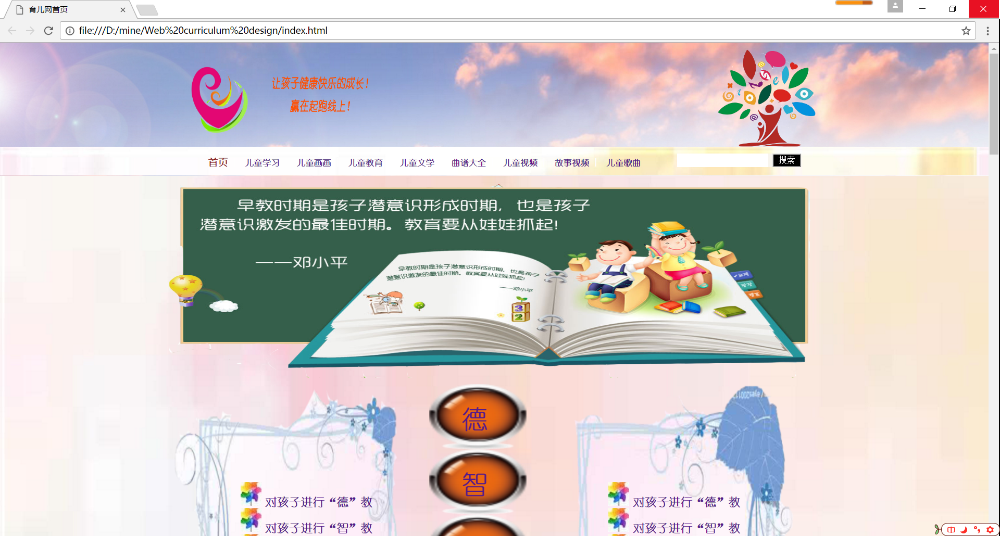
  
图1 首页屏幕截图

>主要实现功能：介绍此网站的大致内容，儿童要德、智、体、美、劳全面发展，内容列表，展现儿童开心快乐的一面。

>首页导航栏功能：引导读者打开自己想看的页面。
  	
>首页是网站的主体概括性较强的网页。

（2）内容页：

屏幕截图：

  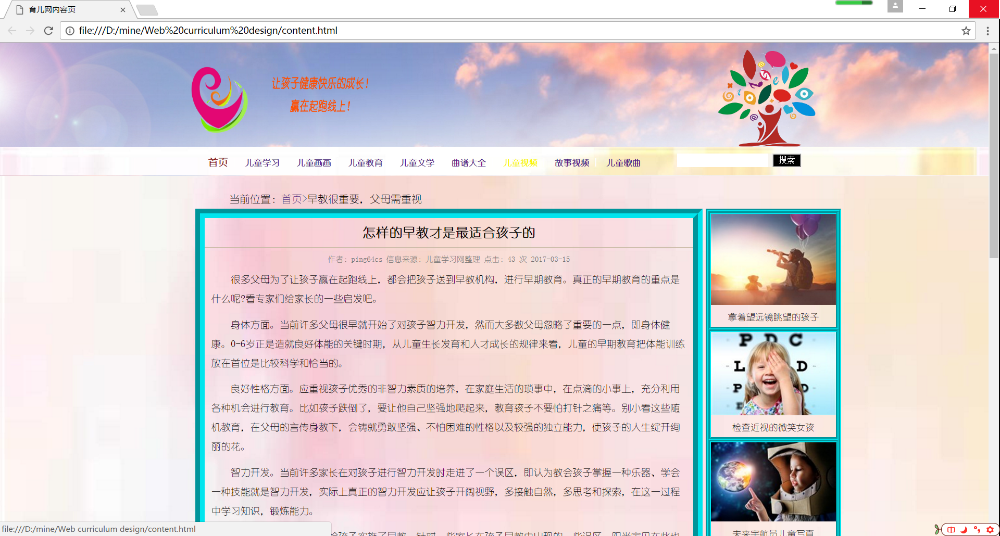
  
图2 内容页屏幕截图

>主要实现功能：讲述此网站的主要内容以及说明儿童教育的重要性。

（3） 列表页：

屏幕截图：

  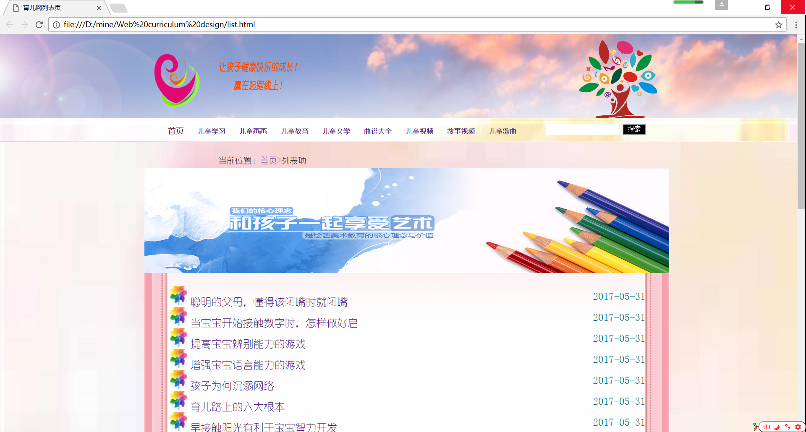
  
图3 列表页屏幕截图

>主要实现功能：详细的列表方便人们查找自己想要的内容。

（4）	故事页面：

屏幕截图：

  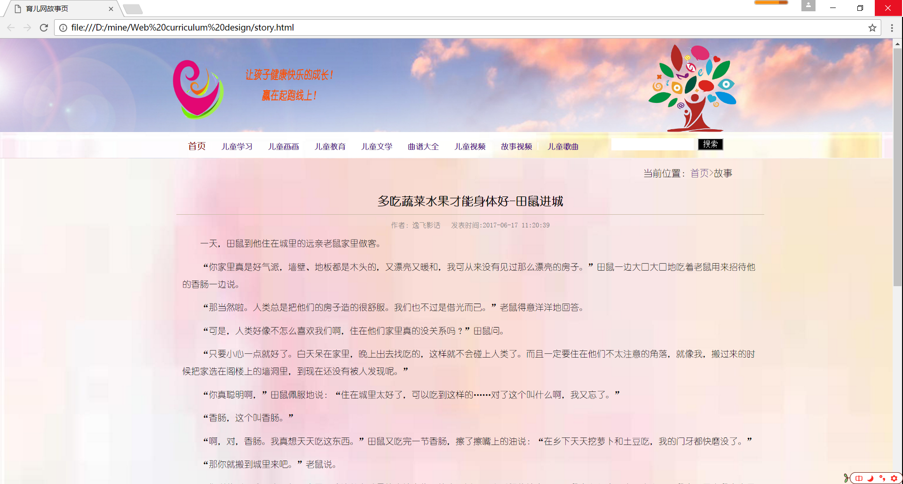
  
图4 故事页1屏幕截图

  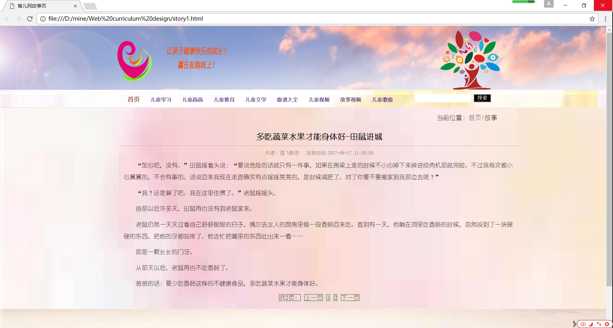
  
图5 故事页2屏幕截图

>主要实现功能：看故事。

（3） 音乐页：

屏幕截图：

  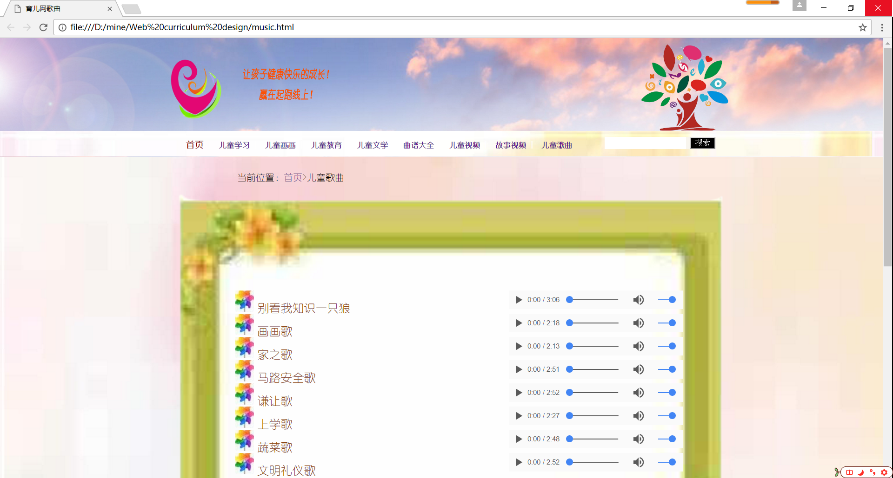
  
图5 音乐页屏幕截图

>主要实现功能：儿童歌曲大全。

#### 2.	搜集网站素材

>参考网站1：http://588ku.com/beijing/0-28-pxnum-0-8-0-0-0-1/
>参考网站2：http://www.tooopen.com/img
>一些图片经过PS加工，改变格式再应用在此网站中。

#### 3.	建立网站代码目录结构

  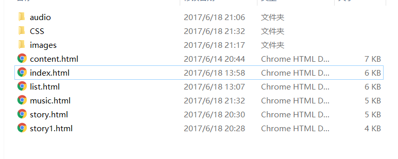
  
  图6 目录结构

#### 4.	编写HTML代码

（1）	首页部分：

>整体结构 
>核心源代码

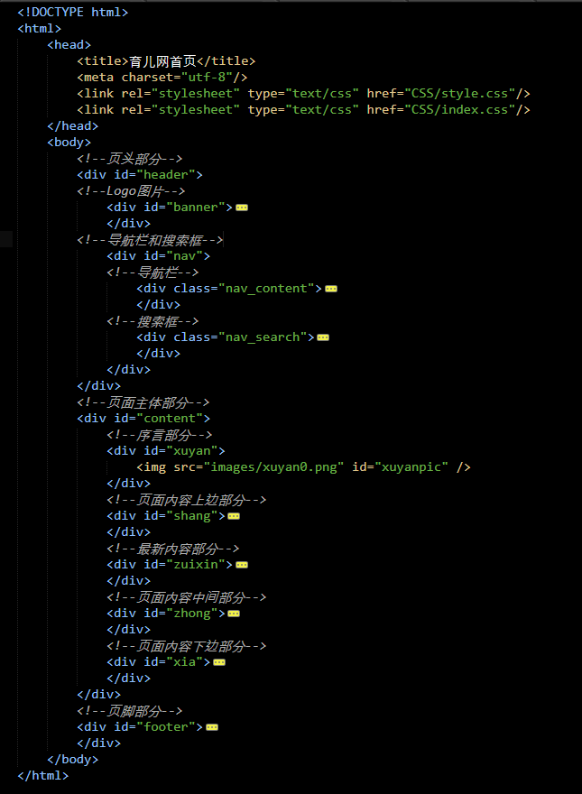

图7 首页结构

（2） 内容页：

>整体结构 
>核心源代码

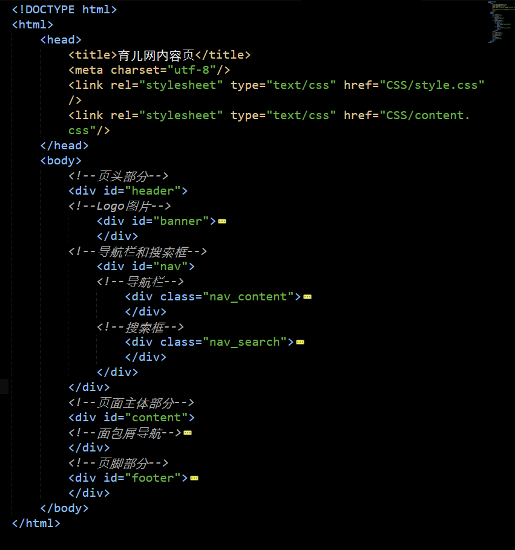

图8 内容页结构

（3） 列表页：

>整体结构 
>核心源代码

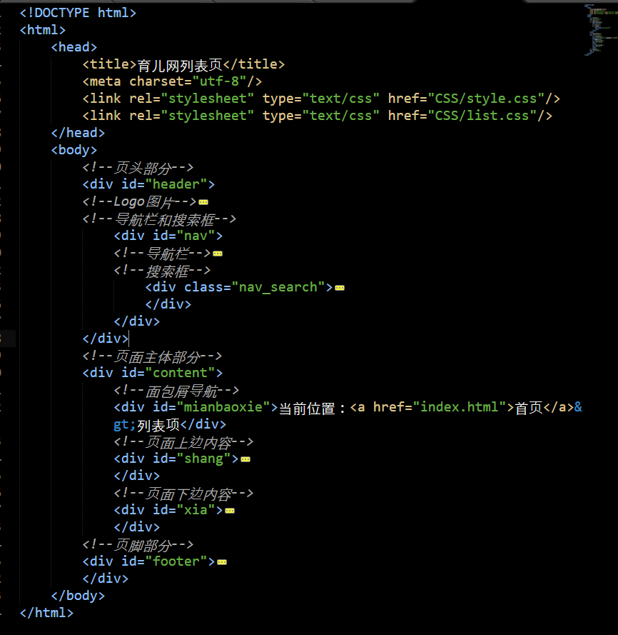

图9 列表页结构

（4） 故事页：

>整体结构 
>核心源代码

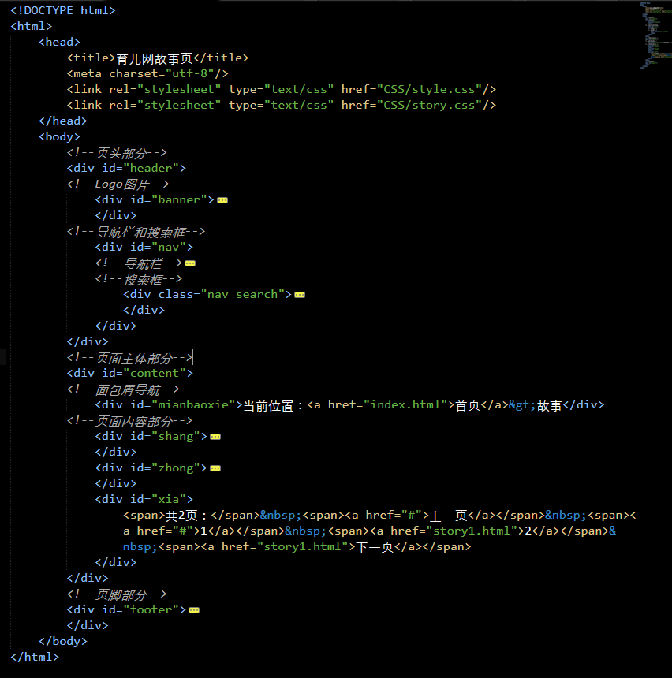

图10 故事页结构

（5） 音乐页：

>整体结构 
>核心源代码

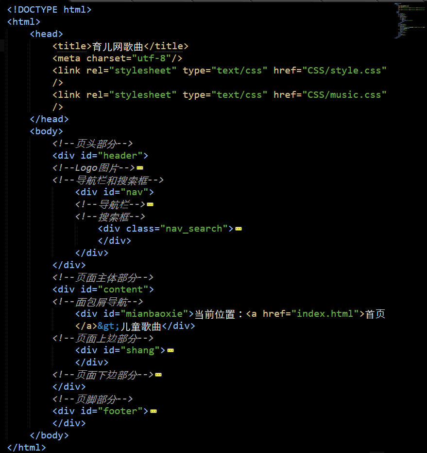

图11 音乐页结构

#### 5.	编写CSS布局及样式

（1）	CSS布局：秉承着先整体后局部的理念，先构思整体布局，再构思内部布局，以及再考虑相应的细节。先设置通用类属性，*{margin:0px;padding:0px;}
      以及一些body上一些一样的属性，像li、a、font、background等等属性。再设置各部分的属性。

>核心技术：就是head的设置和面包屑的设置，还有就是底部的设置，需要找清楚位置再放，设置float属性时要记得同一级的都设置上。
>Float实现布局：让页面主体部分具有结构感，可以让自己的布局充分的在这个页面展现出来。
>Position辅助布局：暂时没有用到。
	 
核心源代码：

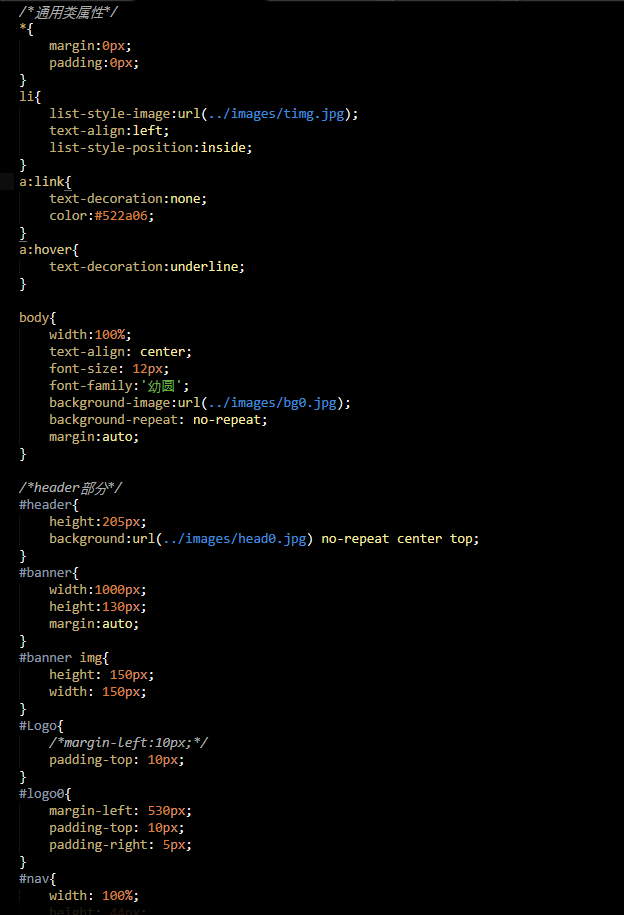

图12 核心源代码

（2）	添加CSS样式：
>通用类属性：*{margin:0px;padding:0px;}

>背景相关类属性：body{width:100%;text-align: center;font-size: 12px;font-family:'幼圆';background-image:url(../images/bg0.jpg);background-repeat: no-repeat;margin:auto;}

>盒子相关属性：float:left;width:191px;height:21px;background-color:#f8f5ee;margin-top:10px;margin-right: 0px;border:1px solid 330000;

#### 6.	调试浏览器兼容性

>在IE10+中的表现：

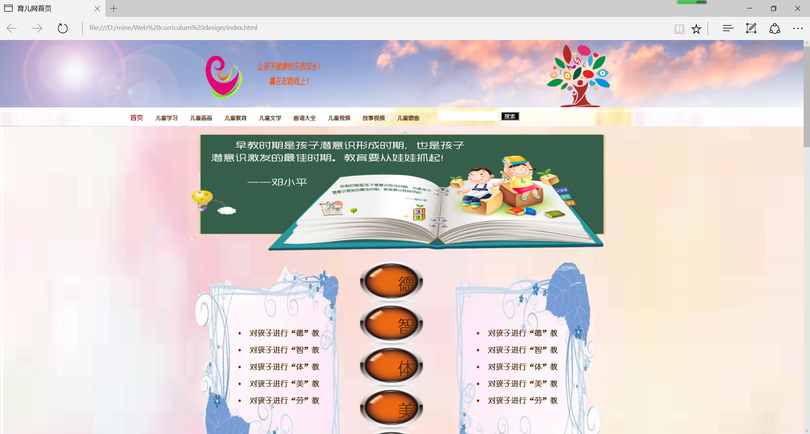

图12 在IE浏览器中的体现

>在火狐中的表现：

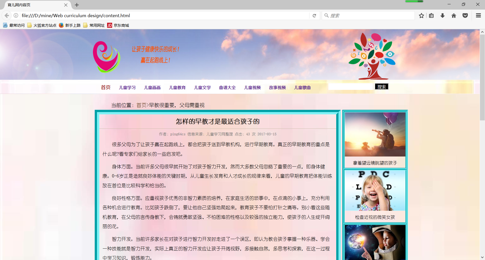

图13 在火狐浏览器中的体现

>在Chrome中的表现：

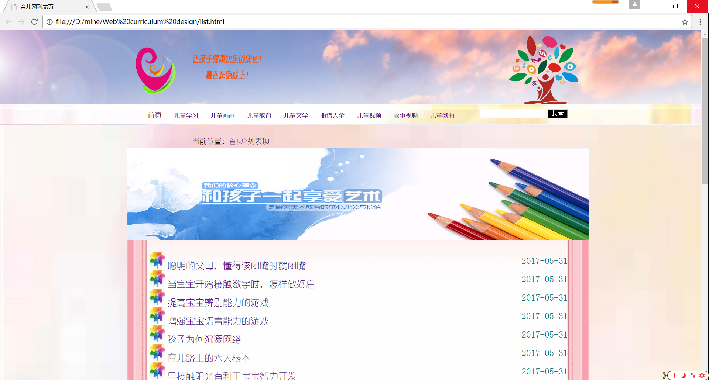

图14 在谷歌浏览器中的体现

### 问题记录

1.	问题表现：自己设置的div属性没有按照自己预期的位置出现。
2.	问题表现：文字重叠
3.  问题表现：图片出不来

### 设计总结

1.	需求分析阶段的经验：设置时头脑中要清晰的记得自己要设计的板块，适当的应用PhotoShop工具来进行绘图和图片格式的改变。

2.	编写HTML代码的经验：不要设置过多的div盒子，对相同的属性不同的值设置多次，不然会代码混乱，无法显示你想要的内容。

3.	CSS布局的经验：先整体后局部，自上而下的去写，不要去设置不必要的选择器，可以用派生选择器。

4.	设置CSS样式经验：按照老师叫的格式来写，html文件里没有的属性，css样式不要乱设置，看清html文件的设置的是哪一种选择器自己对应的来写。

5.	调整浏览器兼容性经验：还是谷歌的浏览器兼容性还比较好，但是IE浏览器会出现问题，那就要求我们看看自己设置的那里出了问题，是图片格式不对，还是内外边距需要重新设置。

6.	Sublime Text使用经验：要求显示页面时，注意保存代码后才会显示。写代码时为了方便寻找和观看，每写完一个属性就换行。

### 课程小结	

1.	HTML内容：详细内容参见HTML文件的码。

2.	CSS内容：详细内容参见css文件代码。

3.	网上参考的内容：参考相关类型的网站。http://www.61xue.com/

4.	浏览器对CSS的兼容性上的不同表现：

 >图片显示的位置有些不同，在IE浏览器会出现此类问题但是在其他浏览器上就没有。而且有的图片还没有显示出来，不符合我的网页设计要求。
 >在谷歌、火狐、2345浏览器上显示出的网页就是我所设计的网页。

### 解决方案：

>更改图片格式，重新设置内外边距。

### 参考文献

1.	http://blog.sina.com.cn/lm/top/rank/（看看别人的博客）

2.	http://qzone.qq.com/index.html

3.	CSS盒子模型及DIV布局

4.	浏览器对CSS的兼容性：http://www.div-css.com/html/XHTML-CSS/hack/1136667.html
http://www.divcss5.com/css-hack/c23.html
http://www.divcss5.com/css-hack/

